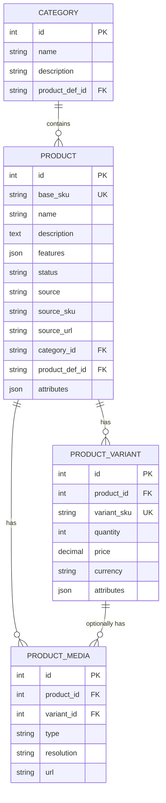

# Data Model Specification

This document defines the database schema for the Waterlily product service.

## Entity Relationship Diagram



---

## Table Definitions

### categories

Categorizes products into logical groups.

| Column | Type | Constraints | Description |
|--------|------|-------------|-------------|
| id | INT | PRIMARY KEY | UUID |
| name | VARCHAR(255) | NOT NULL | Category name |
| description | TEXT | NULLABLE | Category description |
| product_def_id | VARCHAR(36) | NULLABLE, FK | Product definition reference (future use) |
| created_at | TIMESTAMP | NOT NULL, DEFAULT NOW() | Record creation time |
| updated_at | TIMESTAMP | NOT NULL, DEFAULT NOW() | Last update time |

**Indexes:**
- `PRIMARY KEY (id)`
- `INDEX idx_categories_name (name)`

---

### products

Main product entity containing all consumer goods information.

| Column | Type | Constraints | Description |
|--------|------|-------------|-------------|
| id | BIGINT | PRIMARY KEY | UUID, randomly generated |
| base_sku | VARCHAR(50) | NOT NULL, UNIQUE | Stock keeping unit |
| name | VARCHAR(500) | NOT NULL | Product name |
| description | TEXT | NULLABLE | Product description (text/html/json) |
| features | JSON | NULLABLE | Product main features as JSON array |
| status | VARCHAR(20) | NOT NULL | Product status (ACTIVE, INACTIVE, etc.) |
| source | VARCHAR(10) | NOT NULL | Data source (AMZ=Amazon) |
| source_sku | VARCHAR(100) | NULLABLE | Original SKU from source |
| source_url | VARCHAR(2000) | NULLABLE | Original product URL |
| category_id | VARCHAR(36) | NOT NULL, FK | Reference to categories.id |
| product_def_id | VARCHAR(36) | NULLABLE, FK | Product definition reference |
| attributes | JSON | NULLABLE | Product-specific attributes |
| created_at | TIMESTAMP | NOT NULL, DEFAULT NOW() | Record creation time |
| updated_at | TIMESTAMP | NOT NULL, DEFAULT NOW() | Last update time |

**Indexes:**
- `PRIMARY KEY (id)`
- `UNIQUE INDEX idx_products_base_sku (base_sku)`
- `INDEX idx_products_category_id (category_id)`
- `INDEX idx_products_status (status)`
- `INDEX idx_products_source (source)`

**Foreign Keys:**
- `FOREIGN KEY (category_id) REFERENCES categories(id)`

---

### product_variants

Product variations by attributes, price, and quantity.

| Column | Type | Constraints | Description |
|--------|------|-------------|-------------|
| id | BIGINT | PRIMARY KEY | UUID, randomly generated |
| product_id | BIGINT | NOT NULL, FK | Reference to products.id |
| variant_sku | VARCHAR(50) | NOT NULL, UNIQUE | Variant SKU |
| quantity | INT | NOT NULL, DEFAULT 0 | Available quantity |
| price | DECIMAL(15,2) | NOT NULL | Variant price |
| currency | VARCHAR(3) | NOT NULL, DEFAULT 'USD' | ISO currency code |
| attributes | JSON | NULLABLE | Variant-specific attributes |
| created_at | TIMESTAMP | NOT NULL, DEFAULT NOW() | Record creation time |
| updated_at | TIMESTAMP | NOT NULL, DEFAULT NOW() | Last update time |

**Indexes:**
- `PRIMARY KEY (id)`
- `UNIQUE INDEX idx_variants_sku (variant_sku)`
- `INDEX idx_variants_product_id (product_id)`

**Foreign Keys:**
- `FOREIGN KEY (product_id) REFERENCES products(id) ON DELETE CASCADE`

---

### product_media

Product images and videos.

| Column | Type | Constraints | Description |
|--------|------|-------------|-------------|
| id | BIGINT | PRIMARY KEY | UUID, randomly generated |
| product_id | BIGINT | NOT NULL, FK | Reference to products.id |
| variant_id | BIGINT | NULLABLE, FK | Reference to product_variants.id |
| type | VARCHAR(20) | NOT NULL | Media type (IMAGE, VIDEO) |
| resolution | VARCHAR(50) | NOT NULL | Resolution descriptor (high_res, thumb, 1024x768) |
| url | VARCHAR(2000) | NOT NULL | Media URL |
| created_at | TIMESTAMP | NOT NULL, DEFAULT NOW() | Record creation time |

**Indexes:**
- `PRIMARY KEY (id)`
- `INDEX idx_media_product_id (product_id)`
- `INDEX idx_media_variant_id (variant_id)`

**Foreign Keys:**
- `FOREIGN KEY (product_id) REFERENCES products(id) ON DELETE CASCADE`
- `FOREIGN KEY (variant_id) REFERENCES product_variants(id) ON DELETE SET NULL`

---

## Index Strategy for Read Optimization

Given the read-heavy workload (35M products, up to 100k RPS), the following index optimizations are critical:

### Primary Access Patterns

1. **Get product by ID** - Uses primary key index on `products.id`
2. **Get products by multiple IDs** - Uses primary key index with IN clause
3. **Get variants by product_id** - Uses `idx_variants_product_id`
4. **Get media by product_id** - Uses `idx_media_product_id`
5. **Get category by ID** - Uses primary key index on `categories.id`

### Recommendations

| Pattern | Index Used | Expected Performance |
|---------|------------|---------------------|
| Single product lookup | PK(id) | O(1) - Constant |
| Batch product lookup (50 IDs) | PK(id) | O(50) - Linear with batch size |
| Variants by product | idx_variants_product_id | O(log n + k) where k = variant count |
| Media by product | idx_media_product_id | O(log n + k) where k = media count |

### MySQL Configuration Considerations

- InnoDB buffer pool sized to hold hot product data
- Primary key clustering optimizes single-row lookups
- Consider covering indexes if specific columns are frequently accessed

---

## Sample Data Format

### Product Record Example

```sql
INSERT INTO products (id, base_sku, name, description, features, status, source, source_sku, source_url, category_id, attributes)
VALUES (
  '550e8400-e29b-41d4-a716-446655440000',
  'WL-ELEC-001',
  'Wireless Bluetooth Headphones',
  'High-quality wireless headphones with noise cancellation',
  '["Bluetooth 5.0", "40h battery life", "Active noise cancellation"]',
  'ACTIVE',
  'AMZ',
  'B08N5WRWNW',
  'https://amazon.com/dp/B08N5WRWNW',
  'cat-electronics-001',
  '{"brand": "AudioTech", "weight": "250g", "connectivity": "Bluetooth"}'
);
```

---

## Data Volume Estimates

| Table | Expected Rows | Avg Row Size | Total Size (est.) |
|-------|---------------|--------------|-------------------|
| products | 35,000,000 | ~2 KB | ~70 GB |
| product_variants | 70,000,000 | ~500 B | ~35 GB |
| product_media | 140,000,000 | ~300 B | ~42 GB |
| categories | 10,000 | ~500 B | ~5 MB |

**Assumptions:**
- Average 2 variants per product
- Average 4 media items per product
